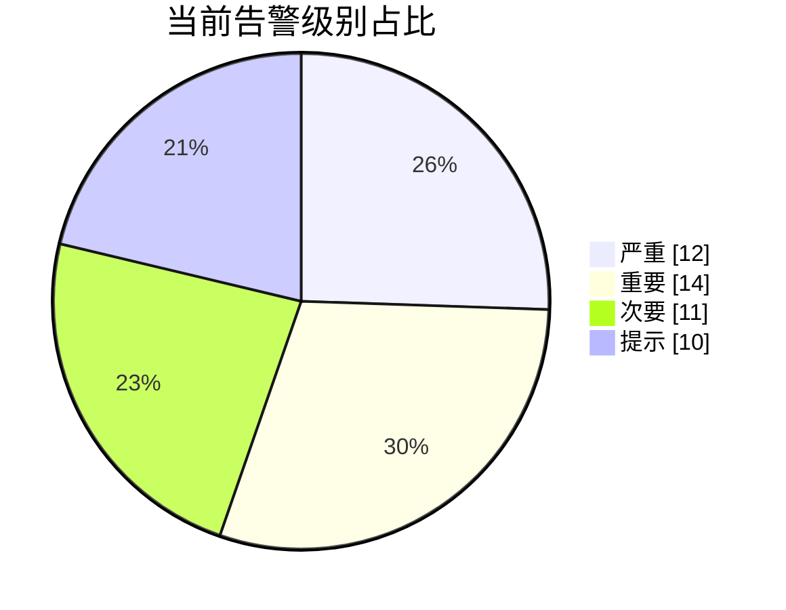
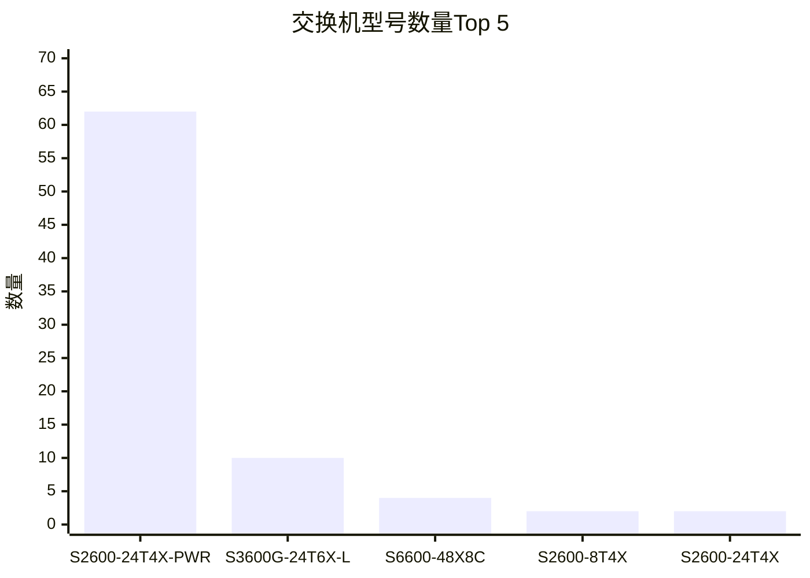
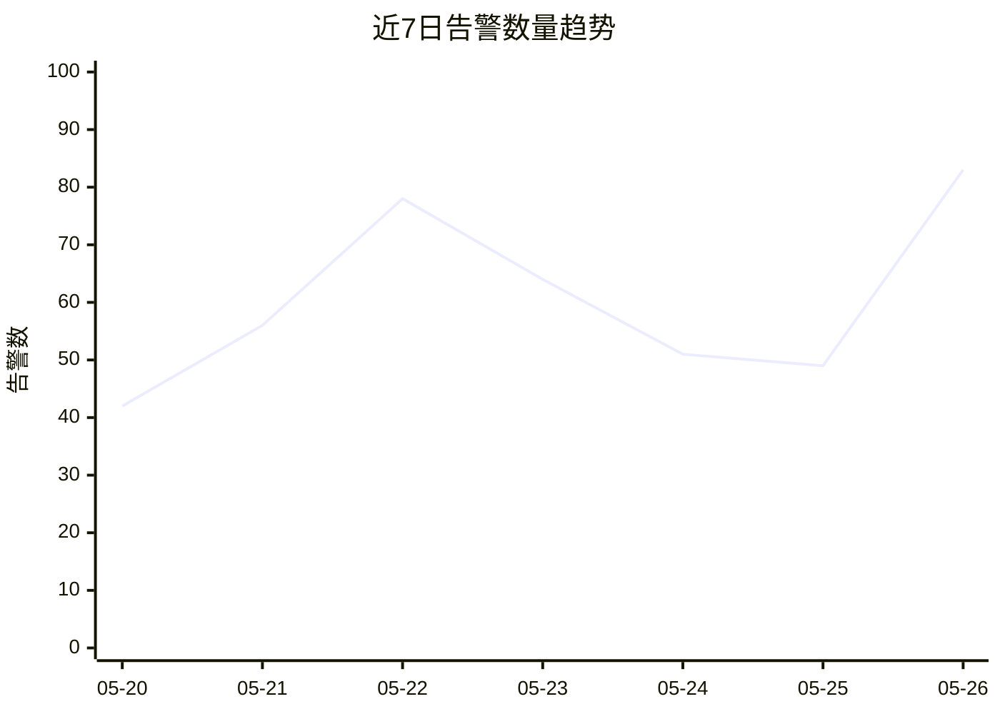
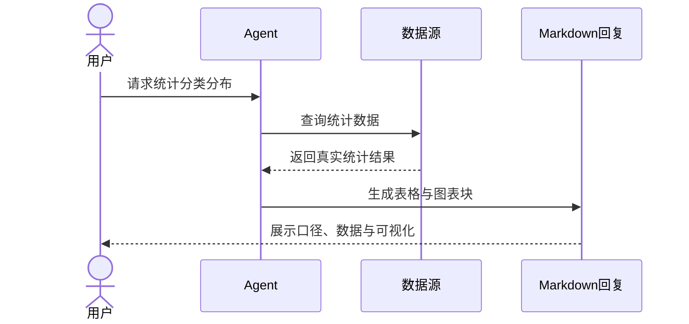
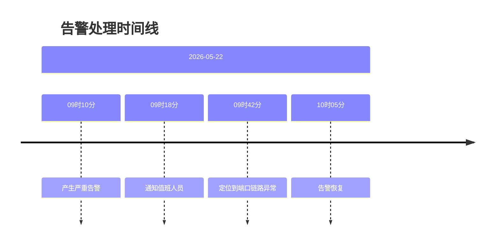
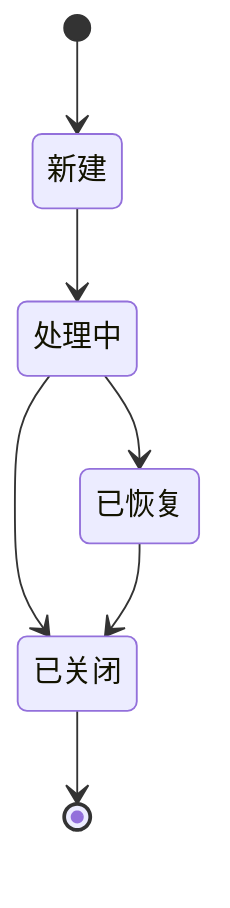
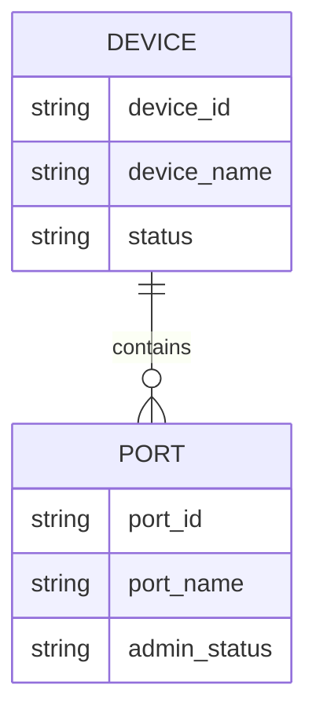
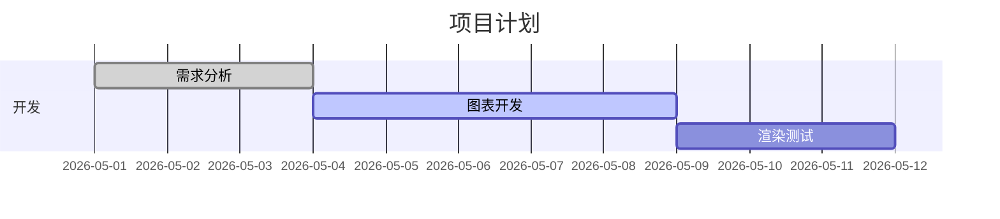

# Data Chart Skill

## 目标

本 Skill 用于把真实查询结果或用户明确提供的数据组织成：

- Markdown 表格
- Mermaid 图表
- Vega-Lite 图表

图表只负责展示，不负责创造数据。

所有数值、标签、排序、占比、趋势和结论必须能追溯到：

- 查询结果（SQL、API、工具返回等）
- 用户明确提供的数据
- 回答中明确说明的统计口径
- 对已有数据进行的可解释计算，例如求和、占比、TopN、均值、最大值、最小值

最终读者是业务用户，不是开发者。输出时应直接呈现结论、表格和图表，不要像教程一样输出模板说明。

---

# 使用场景

当用户要求以下内容时，使用本 Skill：

- 图表
- 可视化
- 数据展示
- 趋势分析
- 占比分析
- TopN 排名
- 状态分布
- 分组对比
- 数据统计结果展示
- 查询结果展示
- 业务数据分析结果

---

# 总原则

## 1. 先表格，后图表

精确数值优先用 Markdown 表格呈现。

图表用于辅助理解：

- 趋势
- 排名
- 占比
- 分布
- 状态
- 层级
- 流程
- 拓扑
- 事件演进
- 复杂统计关系

图表中的数字必须能在表格、查询结果或统计口径中找到来源。

---

## 2. 适合就主动画图

当结果属于以下类型时，应主动生成合适图表：

- 占比
- 状态分布
- 分类分布
- TopN 排名
- 时间趋势
- 多系列趋势
- 分组对比
- 堆叠对比
- 热力分布
- 指标对比
- 层级关系
- 处理流程
- 事件演进

不要先问用户“是否需要生成图表”。

---

## 3. 少讲过程，多给结果

最终回答不要大篇幅描述字段探查、查询构造、取值验证等中间过程。

只保留业务用户理解结果所需的内容：

- 一句话结论
- 统计口径
- 数据规模
- 时间范围
- 过滤条件
- 是否截断
- 异常或空值说明
- Markdown 表格
- Mermaid 或 Vega-Lite 图表
- 必要的补充说明

只有用户明确要求查看查询语句、分析过程或排查细节时，才展开过程。

---

## 4. 不编造数据

没有查询到数据时，不要生成假图表。

应说明：

- 未查询到符合条件的数据
- 已使用的时间范围
- 已使用的过滤条件
- 已使用的统计口径
- 数据源或表名，如可公开展示

---

## 5. 图表必须自洽

图表必须与表格和统计口径一致：

- 标题一致
- 单位一致
- 时间范围一致
- 过滤条件一致
- TopN 口径一致
- 排序一致
- 数值一致
- 分组口径一致

---

## 6. 直接呈现，不教学

最终回答不要输出：

- “可视化建议如下”
- “你可以复制以下代码”
- “推荐使用某某图”
- “模板如下”

应把图表作为正文直接展示。

---

## 7. 默认控制图表规模

默认规则：

- TopN 图表默认展示 Top 5 或 Top 10
- 分组数量超过 10 类时，应截断或合并为“其他”
- 同一回答默认不超过 3 张图
- 明细数据超过 20 行时，默认只展示前 20 行，并说明总数
- 趋势图时间点过多时，优先按日、周、月聚合

---

## 8. 语法优先稳定

所有图表代码块必须闭合。

Mermaid 和 Vega-Lite 代码块内必须保留真实换行。

不要把多条图表指令压缩成一行。

标签尽量短。

复杂字段、长 ID、UUID、完整设备名、完整告警文本应放到表格中，不要塞进图表节点或坐标轴标签。

---

# 图表选择规则

| 数据意图 | 首选展示 |
|---|---|
| 精确明细、字段对照 | Markdown 表格 |
| 少量 KPI 看板 | Markdown 表格 |
| 简单占比、状态分布、分类构成 | Mermaid pie |
| 复杂占比、分组占比、带 tooltip 的构成分析 | Vega-Lite |
| 简单 TopN 排名 | Mermaid xychart-beta bar |
| 复杂 TopN、分组排名、堆叠排名 | Vega-Lite |
| 简单时间趋势 | Mermaid xychart-beta line |
| 多系列时间趋势 | Vega-Lite line |
| 分组柱状图 | Vega-Lite bar |
| 堆叠柱状图 | Vega-Lite stacked bar |
| 热力分布 | Vega-Lite rect |
| 散点关系 | Vega-Lite point |
| 箱线分布 | Vega-Lite boxplot |
| 层级关系、拓扑、处理流程 | Mermaid flowchart |
| 操作步骤、查询链路、调用过程 | Mermaid sequenceDiagram |
| 事件演进 | Mermaid timeline |
| 状态流转 | Mermaid stateDiagram |
| ER 模型 | Mermaid erDiagram |
| 项目计划 | Mermaid gantt |

---

# 不应画图的场景

以下情况不要强行生成图表：

- 查询结果为空
- 只有 1 条明细，图表没有信息增益
- 数据字段主要是长文本、备注、描述、ID
- 分组口径不一致
- 不同单位指标被要求放在同一坐标轴
- 数据存在明显异常且无法解释
- 分组过多但无法 TopN 或合并“其他”
- 图表标签包含手机号、身份证号、邮箱、Token、密钥、精确地址等敏感信息
- 用户只要求返回原始明细
- 渲染环境不支持对应图表语法

遇到上述情况，应优先用表格和文字说明。

---

# 推荐回答结构

当用户要求“图表”“可视化”“分析结果”“数据展示”时，优先按以下顺序组织：

1. 一句话结论
2. 统计口径
3. Markdown 表格
4. Mermaid 或 Vega-Lite 图表
5. 补充说明

不要把“第一步、第二步、第三步”式的探查过程作为默认回答主体。

---

# 数据规模与截断规则

## 明细表

明细超过 20 行时，默认展示前 20 行。

说明格式：

> 共查询到 N 条明细，当前仅展示前 20 条。

## TopN

默认展示：

- Top 5：适合字段名较长、业务用户只关心重点
- Top 10：适合排名对比、分布较均匀

说明格式：

> 当前展示数量排名 Top 10，其余分组未在图中展示。

## Others 合并

当分组超过 10 类，且需要表达整体构成时，可合并为“其他”。

要求：

- “其他”必须是真实汇总
- 表格中应说明“其他 = 非 TopN 汇总”
- 不得把未知数据随意归入“其他”

---

# 数值与单位规则

## 数量

数量使用整数。

示例：

- 设备数：126 台
- 告警数：37 条
- 端口数：2048 个

## 百分比

默认保留 1 位或 2 位小数。

占比计算口径必须说明：

> 占比 = 当前分类数量 / 总数量。

## 金额

金额应说明币种，默认保留 2 位小数。

示例：

- ¥12,345.67
- USD 3,210.00

## 大数

表格中优先保留原始值。

图表中可使用万、亿等单位，但必须在标题或 y 轴中说明。

## 时间

时间格式应统一。

推荐格式：

- 日期：`YYYY-MM-DD`
- 日期时间：`YYYY-MM-DD HH:mm:ss`
- 月份：`YYYY-MM`
- 小时：`HH时`

## 空值

空值不要无声丢弃。

可展示为：

- 未知
- 未填写
- 无归属
- 空值

如过滤掉空值，必须说明过滤口径。

---

# 敏感信息处理

图表标签中不得直接展示：

- 手机号
- 身份证号
- 邮箱
- Token
- API Key
- 密钥
- 精确地址
- 账号密码
- 个人姓名，除非用户明确授权或业务场景必要

处理方式：

- 脱敏
- 用编号代替
- 仅在表格中按权限展示
- 聚合展示，不展示单个敏感主体

示例：

| 原始字段类型 | 图表展示方式 |
|---|---|
| 手机号 | 用户A、用户B |
| 邮箱 | 邮箱域名统计 |
| 设备 UUID | 设备1、设备2 |
| 精确地址 | 城市 / 区域级别 |

---

# Markdown 表格规范

Markdown 表格用于展示精确数据，是所有数据可视化的默认基础展示。

适合：

- 明细
- 字段对照
- 精确数值
- TopN 原始数据
- 占比明细
- 异常列表
- 数据截断说明
- 图表对应的数据底表

要求：

- 数值列右对齐
- 保留原始数量
- 占比类图表必须在表格中给出数量和占比
- 如存在截断，必须说明总数和展示行数
- 如存在空值，必须说明处理方式

---

# Mermaid 图表规范

## Mermaid 总规则

- 每条 Mermaid 指令独占一行
- 代码块必须使用 `mermaid`
- 不要把复杂长文本放入节点
- 节点标签尽量短
- 数字必须来自真实数据
- 图表标题必须与统计口径一致
- 中文标签可用，但避免特殊符号
- 代码块必须闭合

---

## 占比分布：pie

适用于：

- 在线 / 离线占比
- 告警级别占比
- 设备状态占比
- 资源类型构成

示例：



表格中必须保留原始数量和占比。

---

## 柱状图：xychart-beta bar

适用于：

- TopN 排名
- 简单数量对比
- 单指标分类对比

硬性语法：

- `title` 必须写成 `title "标题"`
- 标题必须用英文双引号包裹
- `x-axis` 必须是字符串数组
- `y-axis` 必须写范围
- `bar` 必须是纯数字数组

正确示例：



### y-axis 上限规则

`y-axis` 上限应大于等于最大值。

推荐：

- 最大值 × 1.1 到 1.2
- 再向上取整
- 如果最大值很小，可直接取整数上界

---

## 趋势图：xychart-beta line

适用于：

- 简单单指标时间趋势
- 每日告警数
- 每月订单数
- 每小时请求数

示例：



当存在多系列趋势时，优先使用 Vega-Lite。

---

## 资源层级 / 处理流程：flowchart

适用于：

- 资源层级
- 链路关系
- 业务处理流程
- 简单拓扑

示例：


---

## 查询与展示链路：sequenceDiagram

适用于用户要求查看执行链路、排查过程或系统交互时。

普通回答不要默认展示过程链路。

示例：



---

## 事件时间线：timeline

适用于：

- 告警处理
- 同步任务
- 巡检事件
- 工单流转
- 故障恢复过程

示例：



注意：

- timeline 左侧时间标签不要直接写 `09:10`
- 英文冒号会与 `时间 : 事件` 分隔符冲突
- 可改为 `09时10分`、`09-10` 或短文本

---

## 状态流转：stateDiagram

适用于：

- 工单状态
- 告警生命周期
- 任务状态
- 审批流程

示例：



---

## ER 模型：erDiagram

适用于：

- 数据表关系
- 主外键关系
- 实体模型

示例：



普通业务回答不要默认展示 ER 图，除非用户要求看数据模型或表关系。

---

## 甘特图：gantt

适用于：

- 项目计划
- 任务排期
- 阶段进度
- 里程碑展示

示例：



---

# Vega-Lite 图表规范

## Vega-Lite 总规则

Vega-Lite 用于复杂统计图表。

代码块必须使用：

```text
vega-lite
```

必须遵守：

- 必须是合法 JSON
- 不允许 JSON 注释
- 字符串必须使用英文双引号
- 末尾不能有多余逗号
- 必须包含 `$schema`
- `data.values` 必须来自真实结果
- 图表标题必须与统计口径一致
- 字段名必须与 `data.values` 中字段一致
- 所有编码字段必须存在
- 不要在图表中暴露敏感字段
- 复杂原始字段应先在表格中展示，图表中使用短标签

---

## 推荐字段名

| 含义 | 推荐字段名 |
|---|---|
| 日期 | date |
| 时间 | time |
| 分类 | category |
| 状态 | status |
| 数量 | count |
| 占比 | ratio |
| 指标 | metric |
| 数值 | value |
| 分组 | group |
| 级别 | level |

---

## 简单柱状图：bar

适用于：

- 分类数量对比
- TopN 排名
- 单指标排名

示例：

```vega-lite
{
  "$schema": "https://vega.github.io/schema/vega-lite/v5.json",
  "title": "交换机型号数量Top 5",
  "data": {
    "values": [
      {"model": "S2600-24T4X-PWR", "count": 62},
      {"model": "S3600G-24T6X-L", "count": 10},
      {"model": "S6600-48X8C", "count": 4},
      {"model": "S2600-8T4X", "count": 2},
      {"model": "S2600-24T4X", "count": 2}
    ]
  },
  "mark": "bar",
  "encoding": {
    "x": {
      "field": "model",
      "type": "nominal",
      "title": "型号",
      "sort": "-y"
    },
    "y": {
      "field": "count",
      "type": "quantitative",
      "title": "数量"
    },
    "tooltip": [
      {"field": "model", "type": "nominal", "title": "型号"},
      {"field": "count", "type": "quantitative", "title": "数量"}
    ]
  }
}
```

---

## 横向柱状图：horizontal bar

适用于：

- 标签较长的 TopN
- 设备型号
- 告警名称
- 区域名称
- 业务名称

示例：

```vega-lite
{
  "$schema": "https://vega.github.io/schema/vega-lite/v5.json",
  "title": "告警名称数量Top 5",
  "data": {
    "values": [
      {"alarm": "端口链路中断", "count": 48},
      {"alarm": "设备离线", "count": 31},
      {"alarm": "CPU使用率过高", "count": 22}
    ]
  },
  "mark": "bar",
  "encoding": {
    "y": {
      "field": "alarm",
      "type": "nominal",
      "title": "告警名称",
      "sort": "-x"
    },
    "x": {
      "field": "count",
      "type": "quantitative",
      "title": "数量"
    },
    "tooltip": [
      {"field": "alarm", "type": "nominal", "title": "告警名称"},
      {"field": "count", "type": "quantitative", "title": "数量"}
    ]
  }
}
```

---

## 折线图：line

适用于：

- 时间趋势
- 每日告警量
- 每小时请求量
- 每月订单量

示例：

```vega-lite
{
  "$schema": "https://vega.github.io/schema/vega-lite/v5.json",
  "title": "近7日告警数量趋势",
  "data": {
    "values": [
      {"date": "2026-05-20", "count": 42},
      {"date": "2026-05-21", "count": 56},
      {"date": "2026-05-22", "count": 78},
      {"date": "2026-05-23", "count": 64},
      {"date": "2026-05-24", "count": 51},
      {"date": "2026-05-25", "count": 49},
      {"date": "2026-05-26", "count": 83}
    ]
  },
  "mark": {
    "type": "line",
    "point": true
  },
  "encoding": {
    "x": {
      "field": "date",
      "type": "temporal",
      "title": "日期"
    },
    "y": {
      "field": "count",
      "type": "quantitative",
      "title": "告警数"
    },
    "tooltip": [
      {"field": "date", "type": "temporal", "title": "日期"},
      {"field": "count", "type": "quantitative", "title": "告警数"}
    ]
  }
}
```

---

## 多系列折线图：multi-line

适用于：

- 多级别告警趋势
- 多区域指标趋势
- 多业务线趋势
- 多设备类型趋势

示例：

```vega-lite
{
  "$schema": "https://vega.github.io/schema/vega-lite/v5.json",
  "title": "近7日各告警级别趋势",
  "data": {
    "values": [
      {"date": "2026-05-20", "level": "严重", "count": 12},
      {"date": "2026-05-20", "level": "重要", "count": 18},
      {"date": "2026-05-21", "level": "严重", "count": 9},
      {"date": "2026-05-21", "level": "重要", "count": 21},
      {"date": "2026-05-22", "level": "严重", "count": 15},
      {"date": "2026-05-22", "level": "重要", "count": 26}
    ]
  },
  "mark": {
    "type": "line",
    "point": true
  },
  "encoding": {
    "x": {
      "field": "date",
      "type": "temporal",
      "title": "日期"
    },
    "y": {
      "field": "count",
      "type": "quantitative",
      "title": "告警数"
    },
    "color": {
      "field": "level",
      "type": "nominal",
      "title": "告警级别"
    },
    "tooltip": [
      {"field": "date", "type": "temporal", "title": "日期"},
      {"field": "level", "type": "nominal", "title": "告警级别"},
      {"field": "count", "type": "quantitative", "title": "告警数"}
    ]
  }
}
```

---

## 分组柱状图：grouped bar

适用于：

- 不同区域下不同状态数量
- 不同业务线下不同级别数量
- 不同设备类型下不同厂商数量

示例：

```vega-lite
{
  "$schema": "https://vega.github.io/schema/vega-lite/v5.json",
  "title": "各区域设备状态分布",
  "data": {
    "values": [
      {"region": "华东", "status": "在线", "count": 120},
      {"region": "华东", "status": "离线", "count": 12},
      {"region": "华南", "status": "在线", "count": 98},
      {"region": "华南", "status": "离线", "count": 8},
      {"region": "华北", "status": "在线", "count": 87},
      {"region": "华北", "status": "离线", "count": 15}
    ]
  },
  "mark": "bar",
  "encoding": {
    "x": {
      "field": "region",
      "type": "nominal",
      "title": "区域"
    },
    "y": {
      "field": "count",
      "type": "quantitative",
      "title": "设备数量"
    },
    "xOffset": {
      "field": "status"
    },
    "color": {
      "field": "status",
      "type": "nominal",
      "title": "状态"
    },
    "tooltip": [
      {"field": "region", "type": "nominal", "title": "区域"},
      {"field": "status", "type": "nominal", "title": "状态"},
      {"field": "count", "type": "quantitative", "title": "数量"}
    ]
  }
}
```

---

## 堆叠柱状图：stacked bar

适用于：

- 总量 + 构成
- 每个区域的状态构成
- 每天不同级别告警构成

示例：

```vega-lite
{
  "$schema": "https://vega.github.io/schema/vega-lite/v5.json",
  "title": "各区域告警级别堆叠分布",
  "data": {
    "values": [
      {"region": "华东", "level": "严重", "count": 12},
      {"region": "华东", "level": "重要", "count": 20},
      {"region": "华东", "level": "次要", "count": 18},
      {"region": "华南", "level": "严重", "count": 9},
      {"region": "华南", "level": "重要", "count": 16},
      {"region": "华南", "level": "次要", "count": 21}
    ]
  },
  "mark": "bar",
  "encoding": {
    "x": {
      "field": "region",
      "type": "nominal",
      "title": "区域"
    },
    "y": {
      "field": "count",
      "type": "quantitative",
      "title": "告警数",
      "stack": "zero"
    },
    "color": {
      "field": "level",
      "type": "nominal",
      "title": "告警级别"
    },
    "tooltip": [
      {"field": "region", "type": "nominal", "title": "区域"},
      {"field": "level", "type": "nominal", "title": "告警级别"},
      {"field": "count", "type": "quantitative", "title": "告警数"}
    ]
  }
}
```

---

## 百分比堆叠柱状图：normalized stacked bar

适用于：

- 不同分组的构成比例对比
- 各区域告警级别占比
- 各业务线状态占比

示例：

```vega-lite
{
  "$schema": "https://vega.github.io/schema/vega-lite/v5.json",
  "title": "各区域告警级别占比",
  "data": {
    "values": [
      {"region": "华东", "level": "严重", "count": 12},
      {"region": "华东", "level": "重要", "count": 20},
      {"region": "华东", "level": "次要", "count": 18},
      {"region": "华南", "level": "严重", "count": 9},
      {"region": "华南", "level": "重要", "count": 16},
      {"region": "华南", "level": "次要", "count": 21}
    ]
  },
  "mark": "bar",
  "encoding": {
    "x": {
      "field": "region",
      "type": "nominal",
      "title": "区域"
    },
    "y": {
      "field": "count",
      "type": "quantitative",
      "title": "占比",
      "stack": "normalize"
    },
    "color": {
      "field": "level",
      "type": "nominal",
      "title": "告警级别"
    },
    "tooltip": [
      {"field": "region", "type": "nominal", "title": "区域"},
      {"field": "level", "type": "nominal", "title": "告警级别"},
      {"field": "count", "type": "quantitative", "title": "数量"}
    ]
  }
}
```

百分比堆叠图仍应在表格中展示原始数量和占比。

---

## 热力图：heatmap

适用于：

- 小时 × 日期
- 区域 × 告警级别
- 设备类型 × 状态
- 时间段 × 业务线
- 资源利用率分布

示例：

```vega-lite
{
  "$schema": "https://vega.github.io/schema/vega-lite/v5.json",
  "title": "按日期和小时统计的告警热力图",
  "data": {
    "values": [
      {"date": "2026-05-20", "hour": "00时", "count": 5},
      {"date": "2026-05-20", "hour": "01时", "count": 8},
      {"date": "2026-05-21", "hour": "00时", "count": 3},
      {"date": "2026-05-21", "hour": "01时", "count": 11}
    ]
  },
  "mark": "rect",
  "encoding": {
    "x": {
      "field": "date",
      "type": "ordinal",
      "title": "日期"
    },
    "y": {
      "field": "hour",
      "type": "ordinal",
      "title": "小时"
    },
    "color": {
      "field": "count",
      "type": "quantitative",
      "title": "告警数"
    },
    "tooltip": [
      {"field": "date", "type": "ordinal", "title": "日期"},
      {"field": "hour", "type": "ordinal", "title": "小时"},
      {"field": "count", "type": "quantitative", "title": "告警数"}
    ]
  }
}
```

---

## 散点图：point

适用于：

- 两个数值指标之间的关系
- CPU 使用率与内存使用率
- 流量与丢包率
- 响应时间与请求量

示例：

```vega-lite
{
  "$schema": "https://vega.github.io/schema/vega-lite/v5.json",
  "title": "设备CPU与内存使用率关系",
  "data": {
    "values": [
      {"device": "设备A", "cpu": 72.5, "memory": 68.2, "status": "正常"},
      {"device": "设备B", "cpu": 91.3, "memory": 86.4, "status": "关注"},
      {"device": "设备C", "cpu": 55.1, "memory": 60.7, "status": "正常"}
    ]
  },
  "mark": "point",
  "encoding": {
    "x": {
      "field": "cpu",
      "type": "quantitative",
      "title": "CPU使用率%"
    },
    "y": {
      "field": "memory",
      "type": "quantitative",
      "title": "内存使用率%"
    },
    "color": {
      "field": "status",
      "type": "nominal",
      "title": "状态"
    },
    "tooltip": [
      {"field": "device", "type": "nominal", "title": "设备"},
      {"field": "cpu", "type": "quantitative", "title": "CPU使用率%"},
      {"field": "memory", "type": "quantitative", "title": "内存使用率%"},
      {"field": "status", "type": "nominal", "title": "状态"}
    ]
  }
}
```

---

## 箱线图：boxplot

适用于：

- 响应时间分布
- 延迟分布
- 各区域资源利用率分布
- 各业务线耗时分布

示例：

```vega-lite
{
  "$schema": "https://vega.github.io/schema/vega-lite/v5.json",
  "title": "各区域端口使用率分布",
  "data": {
    "values": [
      {"region": "华东", "usage": 72.1},
      {"region": "华东", "usage": 81.4},
      {"region": "华东", "usage": 63.5},
      {"region": "华南", "usage": 55.2},
      {"region": "华南", "usage": 69.8},
      {"region": "华南", "usage": 77.6}
    ]
  },
  "mark": "boxplot",
  "encoding": {
    "x": {
      "field": "region",
      "type": "nominal",
      "title": "区域"
    },
    "y": {
      "field": "usage",
      "type": "quantitative",
      "title": "端口使用率%"
    },
    "tooltip": [
      {"field": "region", "type": "nominal", "title": "区域"},
      {"field": "usage", "type": "quantitative", "title": "端口使用率%"}
    ]
  }
}
```

---

## 面积图：area

适用于：

- 趋势累计量
- 流量变化
- 容量变化
- 单指标趋势面积展示

示例：

```vega-lite
{
  "$schema": "https://vega.github.io/schema/vega-lite/v5.json",
  "title": "近7日流量趋势",
  "data": {
    "values": [
      {"date": "2026-05-20", "traffic": 120.5},
      {"date": "2026-05-21", "traffic": 132.8},
      {"date": "2026-05-22", "traffic": 156.2},
      {"date": "2026-05-23", "traffic": 141.7}
    ]
  },
  "mark": "area",
  "encoding": {
    "x": {
      "field": "date",
      "type": "temporal",
      "title": "日期"
    },
    "y": {
      "field": "traffic",
      "type": "quantitative",
      "title": "流量GB"
    },
    "tooltip": [
      {"field": "date", "type": "temporal", "title": "日期"},
      {"field": "traffic", "type": "quantitative", "title": "流量GB"}
    ]
  }
}
```

---

## 分面图：facet

适用于：

- 每个区域单独一张小趋势图
- 每个业务线单独一个分布图
- 多组同结构数据对比

示例：

```vega-lite
{
  "$schema": "https://vega.github.io/schema/vega-lite/v5.json",
  "title": "各区域近3日告警趋势",
  "data": {
    "values": [
      {"region": "华东", "date": "2026-05-20", "count": 12},
      {"region": "华东", "date": "2026-05-21", "count": 18},
      {"region": "华东", "date": "2026-05-22", "count": 15},
      {"region": "华南", "date": "2026-05-20", "count": 9},
      {"region": "华南", "date": "2026-05-21", "count": 14},
      {"region": "华南", "date": "2026-05-22", "count": 11}
    ]
  },
  "facet": {
    "field": "region",
    "type": "nominal",
    "title": "区域"
  },
  "spec": {
    "mark": {
      "type": "line",
      "point": true
    },
    "encoding": {
      "x": {
        "field": "date",
        "type": "temporal",
        "title": "日期"
      },
      "y": {
        "field": "count",
        "type": "quantitative",
        "title": "告警数"
      },
      "tooltip": [
        {"field": "region", "type": "nominal", "title": "区域"},
        {"field": "date", "type": "temporal", "title": "日期"},
        {"field": "count", "type": "quantitative", "title": "告警数"}
      ]
    }
  }
}
```

---

# Vega-Lite 与 Mermaid 的选择边界

## 优先 Vega-Lite

当结果本质是“行列数据的统计可视化”时，优先 Vega-Lite。

例如：

- `date, level, count`
- `region, status, count`
- `device, cpu, memory`
- `business, latency`
- `hour, date, count`

## 优先 Mermaid

当结果本质是“节点、关系、流程、状态或事件演进”时，优先 Mermaid。

例如：

- 顶层 → 中间层 → 底层实体
- 用户请求 → Agent → 数据源 → 可视化结果
- 新建 → 处理中 → 已恢复 → 已关闭
- 09时10分产生告警，10时05分恢复

---

# 输出示例

## 示例：告警级别分布

当前告警以“重要”和“严重”为主，两类合计占比超过一半。

统计口径：统计当前未恢复告警，按告警级别分组；共 47 条。

| 告警级别 | 数量 | 占比 |
|---|---:|---:|
| 严重 | 12 | 25.5% |
| 重要 | 14 | 29.8% |
| 次要 | 11 | 23.4% |
| 提示 | 10 | 21.3% |


---

## 示例：多级别告警趋势

近 3 日重要告警持续高于严重告警，5 月 22 日两类告警均达到观察期内峰值。

统计口径：统计 2026-05-20 至 2026-05-22 每日未恢复告警数量，按告警级别分组。

| 日期 | 告警级别 | 数量 |
|---|---|---:|
| 2026-05-20 | 严重 | 12 |
| 2026-05-20 | 重要 | 18 |
| 2026-05-21 | 严重 | 9 |
| 2026-05-21 | 重要 | 21 |
| 2026-05-22 | 严重 | 15 |
| 2026-05-22 | 重要 | 26 |

```vega-lite
{
  "$schema": "https://vega.github.io/schema/vega-lite/v5.json",
  "title": "近3日各告警级别趋势",
  "data": {
    "values": [
      {"date": "2026-05-20", "level": "严重", "count": 12},
      {"date": "2026-05-20", "level": "重要", "count": 18},
      {"date": "2026-05-21", "level": "严重", "count": 9},
      {"date": "2026-05-21", "level": "重要", "count": 21},
      {"date": "2026-05-22", "level": "严重", "count": 15},
      {"date": "2026-05-22", "level": "重要", "count": 26}
    ]
  },
  "mark": {
    "type": "line",
    "point": true
  },
  "encoding": {
    "x": {
      "field": "date",
      "type": "temporal",
      "title": "日期"
    },
    "y": {
      "field": "count",
      "type": "quantitative",
      "title": "告警数"
    },
    "color": {
      "field": "level",
      "type": "nominal",
      "title": "告警级别"
    },
    "tooltip": [
      {"field": "date", "type": "temporal", "title": "日期"},
      {"field": "level", "type": "nominal", "title": "告警级别"},
      {"field": "count", "type": "quantitative", "title": "告警数"}
    ]
  }
}
```

---

# 质量检查清单

生成最终回答前必须自查：

## 数据一致性

- 图表中的每个数字是否都来自表格、查询结果或用户输入
- 图表排序是否与表格一致
- TopN 是否明确
- “其他”是否为真实汇总
- 百分比是否能由原始数量计算
- 时间范围是否一致
- 单位是否一致

## Markdown 表格

- 是否先展示了精确数据
- 是否说明了总数
- 是否说明了截断
- 是否保留了占比图所需的原始数量
- 空值是否被说明

## Mermaid

- 代码块是否使用 `mermaid`
- 指令是否逐行输出
- `xychart-beta` 的 `title` 是否使用英文双引号
- `x-axis` 是否是字符串数组
- `y-axis` 是否有范围
- `bar` / `line` 是否是纯数字数组
- timeline 时间标签是否避免英文冒号
- sequenceDiagram 消息是否清晰简短
- 代码块是否闭合

## Vega-Lite

- 代码块是否使用 `vega-lite`
- JSON 是否合法
- 是否包含 `$schema`
- `data.values` 是否来自真实数据
- encoding 中的字段是否都存在
- 字段类型是否正确
- tooltip 是否只展示必要字段
- 是否避免展示敏感字段
- 长标签是否已缩短或改用横向柱状图
- 是否避免不同单位混用同一 y 轴

## 安全与可读性

- 是否避免在图表中展示敏感信息
- 是否没有编造数据
- 是否没有输出无意义图表
- 是否没有把过程当主体
- 是否没有使用面向开发者的教学话术
- 图表数量是否控制在合理范围
- 结果是否面向业务用户可读

---

# 默认推荐组合

推荐组合：

```text
Markdown 表格 = 精确数据底座
Vega-Lite = 复杂统计图
Mermaid = 轻量结构图、流程图、时间线和简单图表
```

推荐规则：

- 行列统计数据 → Vega-Lite
- 简单占比 / 简单 TopN / 简单趋势 → Mermaid 或 Vega-Lite
- 流程 / 层级 / 拓扑 / 时间线 / 状态流转 → Mermaid